## MSA TEST

* spring boot 를 이용한 msa 프로젝트 세팅 테스트
* Spring Cloud Gateway
  * Spring Cloud Netflix Eureka 에 의존
  * Gateway도 하나의 서비스
  * Spring Cloud Eureka Client (Gateway 서비스) 동일

* 실행 확인
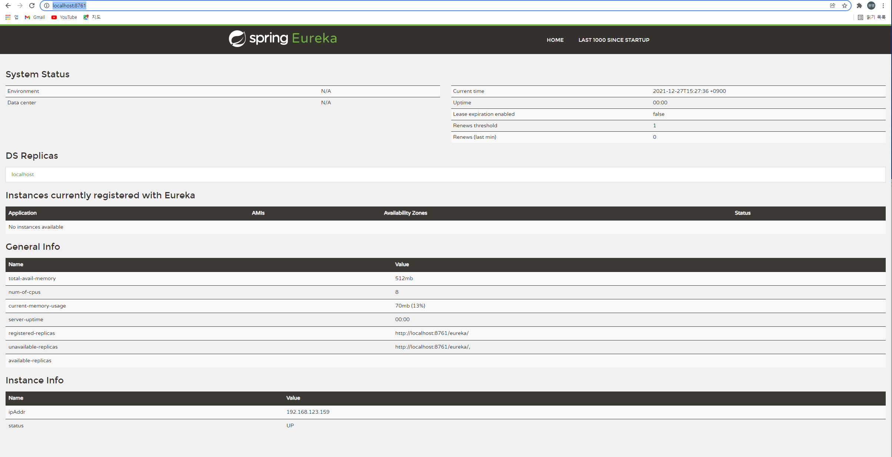

* localhost:8080/user/info, localhost:8000/order/info 로 연결 
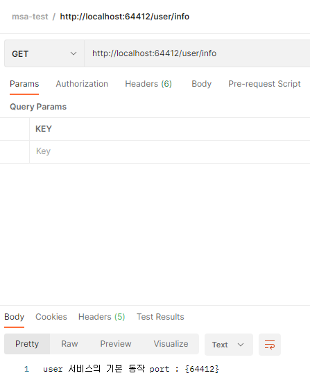  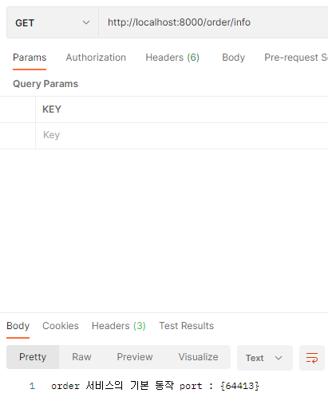

* After, Before
  * 2021년 현재는 2017년 이후(After) 이므로 user-service 는 잘 동작
  * 2021년 현재는 2017년 이전(Before) 아니므로 order-service 는 동작 안함
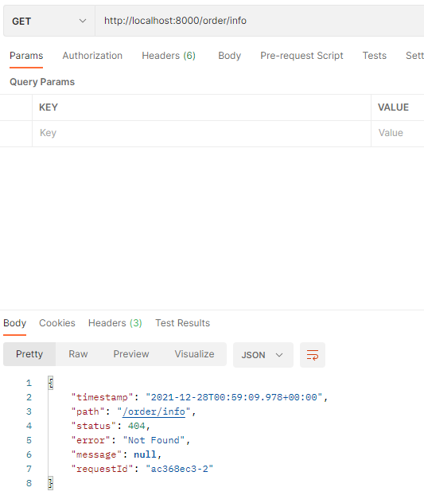  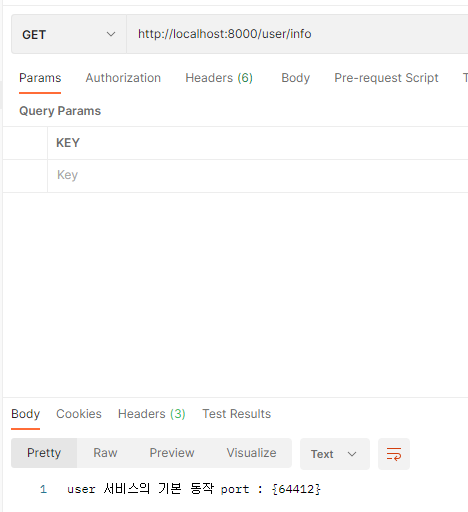

* Cookie
  * user-service 의 valid 필드에 kakao 를 넣으면 잘 동작
  * order-service 의 valid 필드에 kakao 를 넣으면 동작 안함
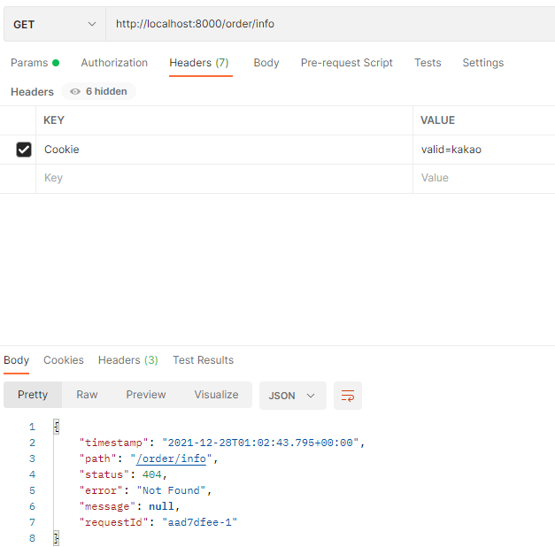  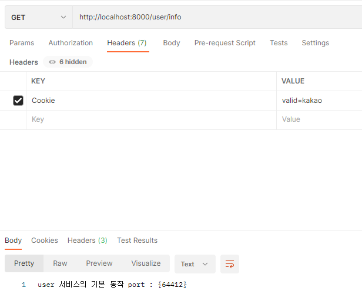

* Method
  * user-service 로 get 요청을 보내면 잘 동작
  * order-service 로 get 요청을 보내면 동작 안함
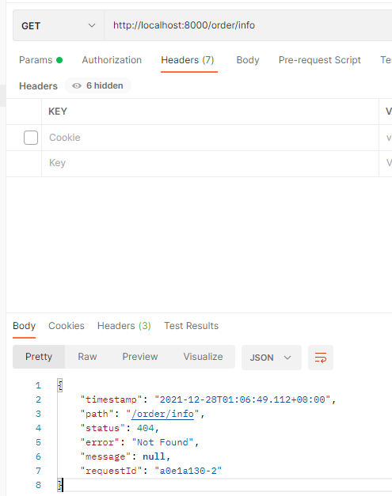  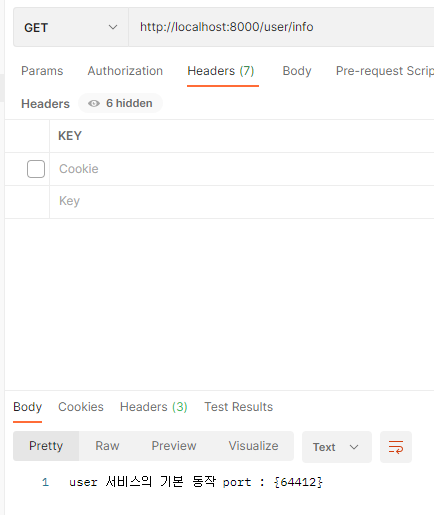

* AddRequestHeader, AddResponseHeader
  * Http Request 에 token=123456 이라는 Request Header 가 추가
  * 응답 헤더에 authenticated=yes 가 출력
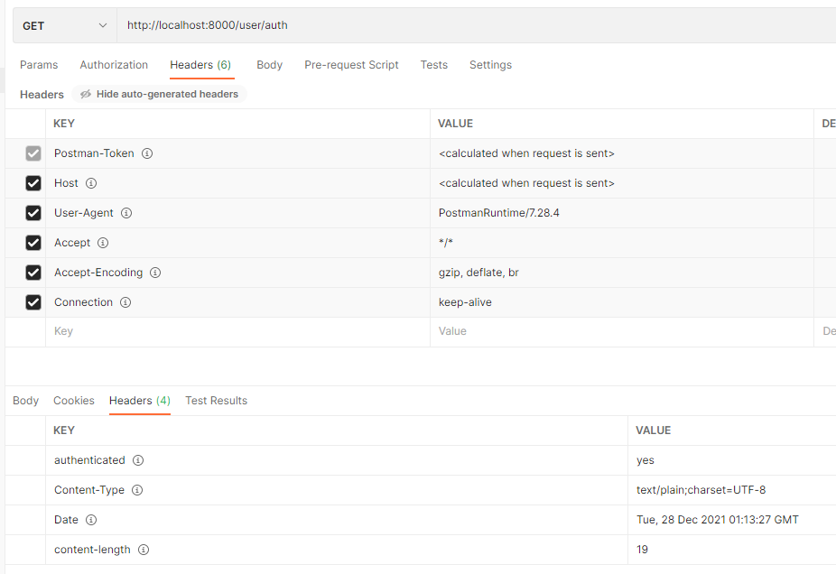  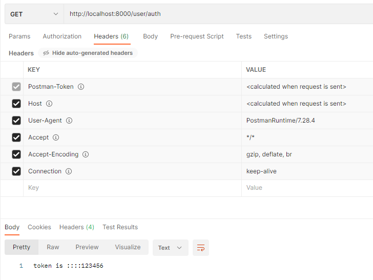

* RewritePath
  * user-service, order-service 의 mapping url 변경 (/user/info -> /info, /order/info -> /info)
  * gateway 에서 호출시에는 /user/info, /order/info 로 해야 함
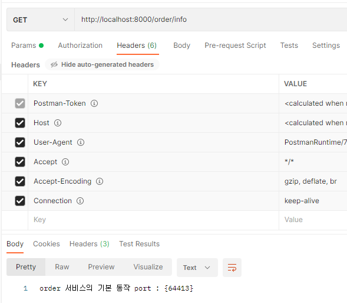  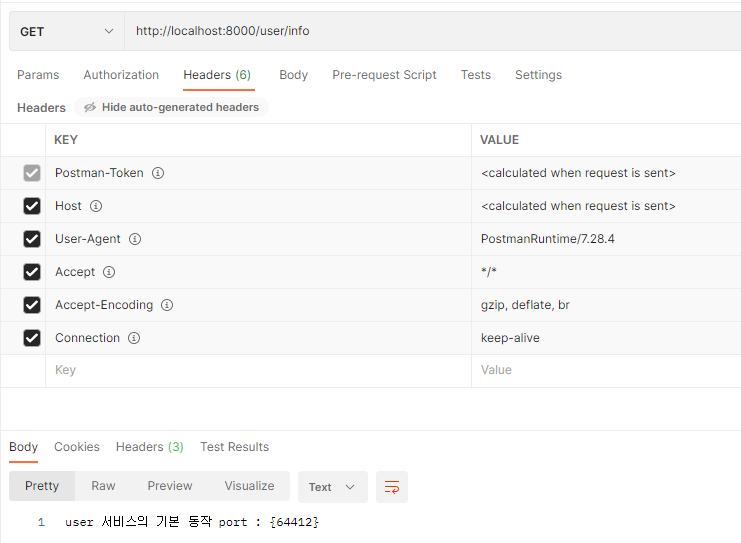

* CustomFilter
  * token 없이 요청 보내기 : 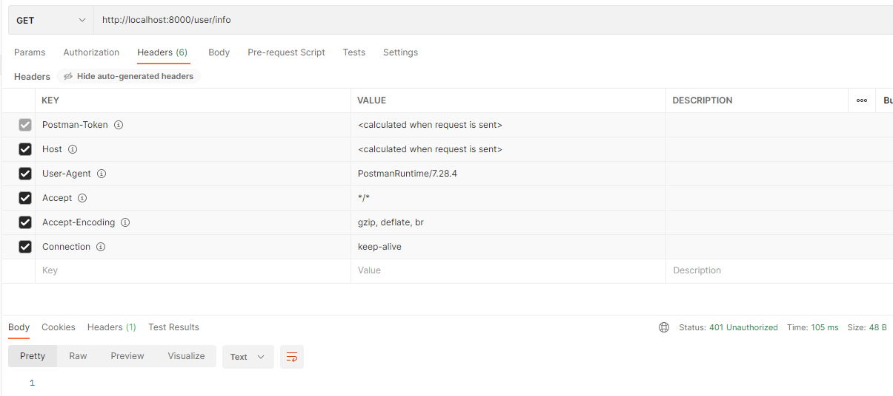
  * invalid token 보내기 : 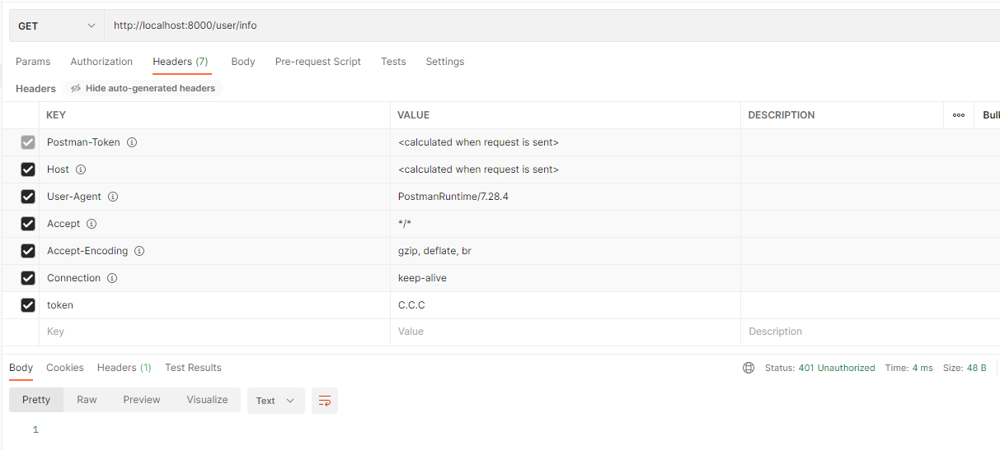
  * 정상 토큰 보내기 : 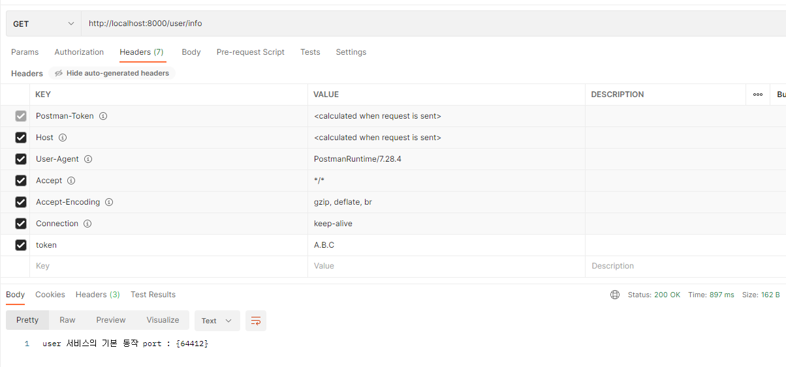
